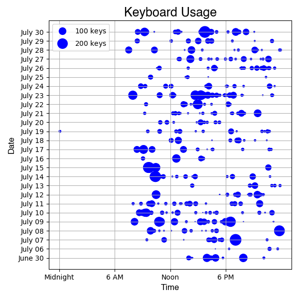
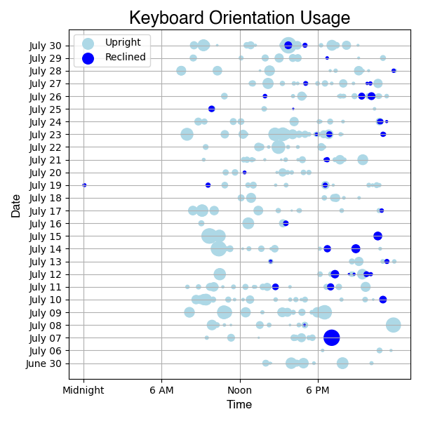
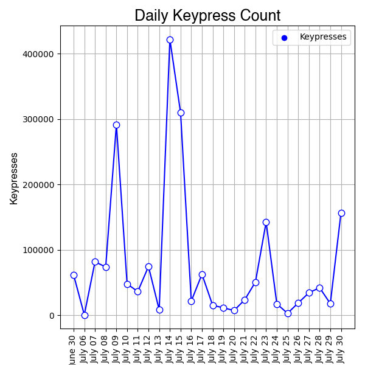

## Before Downloading Data:

1. Create a Github account
2. Create synapse account (email routine.quiches2f@icloud.com to get access)
3. Download Visual Studio Code (or use any editor you prefer)
4. Fork this git repository: [BiAffect Data Analysis](https://github.com/asha828/BiAffect-Data-Analysis) on Github
5. Clone the forked repository to VS code 
    * In forked repository, copy the url found when clicked on the green "code" button  
    * Open up VS code and on the main page click the menu option for "Clone Git Repository" and paste url
    * Select the location for where you want this repository to be (main folder) 
6. Get download access to both the File View and the Test Study Project on Synapse (email routine.quiches2f@icloud.com to get access)
   
7. Install pandas, synapseclient, tqdm, dotenv by running the following in the terminal
    * python3 -m pip install pandas
    * python3 -m pip install synapseclient
    * python3 -m pip install tqdm
    * python3 -m pip install python-dotenv

8. In pull.py, add the following lines of code to the top 
    * `from dotenv import load_dotenv`
    * `load_dotenv()`
9. Create env variable 
    * In VS code, create a new file called .env
    * Get synapse token
    * Write this in your .env file: 
    * `SYNAPSE_AUTH_TOKEN = your synapse token` 
    * `TMPDIR = "your path to a new folder that stores your keyboard data"`
10. Create a new file called .gitignore 
    * Write this in your .gitignore file: .env 

## Downloading Data:

1. In pull.py replace download_dir to your own path 
    *  Make sure to create a **new** folder just for your keyboard data
    * `download_dir = "your path to folder that stores your keyboard data goes here"`

2. Replace health code with your own (can be found on synapse)
    * `health_codes = ["your own health code"]`
3. Run pull.py (you should see a lot of keyboard sessions and a hc_df.parquet file in the folder you chose to store your keyboard data)
4. In parse.py, replace download_dir to your own path
    * Line 288: `download_dir = "your path to folder that stores your keyboard data"`
   (May have to [expand the path](https://docs.python.org/3/library/os.path.html#os.path.expanduser))
5. Replace dat_dir to your own path
    * For dat_dir, make sure to create a **new** folder just for the parsed files
    * Line 289: `dat_dir = "your path to new folder that stores your parsed data"`
   (May have to [expand the path](https://docs.python.org/3/library/os.path.html#os.path.expanduser)) 
6. Run parse.py (you should see a two files: dat_acc.parquet and dat_kp.parquet but make sure to rename those two files to raw_acc.parquet and raw_kp.parquet)

## Pre-processing Data:

1. [Download r and rstudio](https://posit.co/download/rstudio-desktop/)

    * Download r first and then rstudio
2. Copy and paste each command (except the last) found in README_contributing file in BiAffect Data Analysis repo, under "Preprocessing scripts" into the **console** of rstudio 
    * Note that R script will only preprocess a single participant, and all individual preprocessed participant data will have to be combined afterwards 
3. On the last command, paste it into the **source editor** to create a new R file 
    * Rewrite lines 6 and 7 
    * Line 6: `raw_acc <- read_parquet("your path to folder that stores your parsed data/raw_acc.parquet")`

    * Line 7: `raw_kp <- read_parquet("your path to folder that stores your parsed data/raw_kp.parquet")`
4. Rewrite lines 18, 19, 20
    * Line 18 : `write_parquet(dat_acc, "your path to folder that stores your parsed data/dat_acc.parquet")`

    * Line 19: `write_parquet(dat_kp,"your path to folder that stores your parsed data/dat_kp.parquet")`

    * Line 20: `write_parquet(dat_ses, "your path to folder that stores your parsed data/dat_ses.parquet")`
5. Save this R file to your folder that conatins your forked repository (main folder) 
6. Run setwd("your path/ your main folder") in **console** on rstudio and click “Source” in top right corner of the source editor to run this line of code
7. This will save the preprocessed data into your parsed data folder and you should now have: raw_acc.parquet, raw_kp.parquet, dat_acc.parquet, dat_ses.parquet, dat_kp.parquet inside your parsed data folder
8. Now you will be able to use three pandas data frames: 
    * One for keyboard sessions (dat_kp.parquet) 
    * One for accelerometer data (dat_acc.parquet)
    * One for session data (dat_ses.parquet)

## Visualizing Data:

1. Before running the code make sure to have matplotlib installed:
    * python3 -m pip install matplotlib
2. Change all paths to your own path that leads to your parsed data folder

## Graphs:

